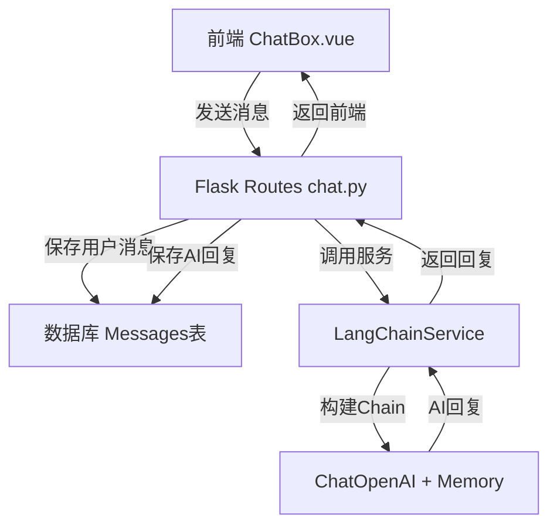

# LangChain 重构聊天模块计划

## 目标
使用 LangChain 框架重构聊天部分，保持 Flask 框架不变，确保聊天消息保存到数据库，用户能查看历史会话消息。

## 架构设计



## 文件结构

```
backend/
├── requirements.txt          # 添加 LangChain 依赖
├── app/
│   ├── services/
│   │   ├── langchain_service.py    # LangChain 核心服务
│   │   └── chat_history_service.py # 聊天历史管理
│   ├── routes/
│   │   └── chat.py          # 重构后的聊天路由
│   └── __init__.py          # 注册服务
```

## 实现步骤

### 1. 添加依赖 (requirements.txt)
```txt
langchain>=0.1.0
langchain-openai>=0.0.5
langchain-community>=0.0.10
```

### 2. LangChain 服务层 (langchain_service.py)
- 使用 `ChatOpenAI` 作为 LLM
- 使用 `ConversationBufferMemory` 管理对话历史
- 支持流式输出
- 保持心理健康咨询师角色设定

### 3. 聊天历史服务 (chat_history_service.py)
- `save_message()` - 保存消息到数据库
- `get_history()` - 从数据库加载历史
- `build_langchain_messages()` - 转换为 LangChain 格式

### 4. 重构聊天路由 (chat.py)
- 集成 LangChain 服务
- 优化消息存储流程
- 保持 SSE 流式响应

### 5. 前端更新
- `ConversationList.vue` - 展示历史会话列表
- `ChatBox.vue` - 优化消息展示

## LangChain 核心特性

| 功能 | 实现 |
|------|------|
| 对话历史记忆 | ConversationBufferMemory |
| 流式输出 | streaming=True |
| 角色设定 | SystemMessage |
| 数据库持久化 | 自定义 ChatHistoryService |

## 注意事项

1. 保持与现有数据库模型兼容
2. 支持 SSE 流式响应
3. 保持预警功能集成
4. 确保向后兼容现有 API 端点